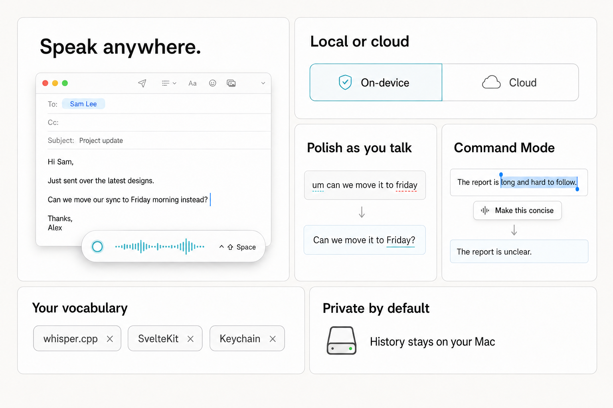

<div align="center">
  

  <h1>Oto for macOS</h1>

  <p><strong>Fast, system-wide push-to-talk dictation for your Mac.</strong></p>
  <p>Hold a shortcut, speak naturally, and release. Oto transcribes your voice, optionally cleans up the writing, and delivers the result to the app you were already using.</p>

  <p>
    
    
    
    
    
  </p>
</div>

Oto is a native macOS voice-input utility built with Tauri, Rust, and SvelteKit. It is designed around a simple interaction: press and hold a global shortcut while you talk, then release it when you are done. A compact, non-focusable overlay communicates the current state without taking over the screen or stealing focus from the destination app.

This repository is the macOS port of [Oto](https://github.com/0veek/oto), with macOS-specific audio capture, permissions, Keychain storage, focus restoration, text insertion, window materials, and app packaging.

<p align="center">
  
</p>

> [!IMPORTANT]
> Oto is currently at version `0.1.0`. It is usable, but configuration fields, provider behavior, and packaging details may change before a stable release. There is no automatic updater yet.

## Why Oto

Most dictation tools force a choice between a cloud-only service, a local model with a developer-oriented interface, or an intrusive floating window. Oto keeps the interaction small while making the underlying pipeline configurable:

- **System-wide push-to-talk** — dictate into browsers, editors, chat apps, notes, and other macOS applications.
- **Cloud or on-device transcription** — use an OpenAI-compatible speech endpoint or a local whisper.cpp-compatible model.
- **Optional writing cleanup** — correct punctuation, grammar, filler words, and tone before insertion.
- **Reusable writing tools** — maintain a personal dictionary, exact-match voice snippets, and style presets.
- **Selected-text commands** — select text and say instructions such as “make this concise” or “translate this to Spanish.”
- **Layered delivery** — Oto restores the original target app and tries multiple macOS insertion strategies.
- **Local-first configuration** — ordinary settings and history remain on the Mac; secrets are stored in Keychain.
- **A restrained Mac interface** — graphite settings, native window vibrancy, and a 220 × 36 liquid-glass-style overlay.

## How it works

```mermaid
flowchart LR
    A["Hold the global shortcut"] --> B["Capture the focused app"]
    B --> C["Record microphone audio"]
    C --> D["Release the shortcut"]
    D --> E{"Transcription backend"}
    E -->|Cloud| F["OpenAI-compatible speech API"]
    E -->|Local| G["whisper-rs"]
    F --> H["Raw transcript"]
    G --> H
    H --> I{"Session type"}
    I -->|Dictation| J{"Exact snippet match?"}
    J -->|Yes| K["Expand snippet"]
    J -->|No| L{"Polish enabled?"}
    L -->|Yes| M["Chat-completions cleanup"]
    L -->|No| N["Keep raw transcript"]
    I -->|Command Mode| O["Rewrite selected text"]
    K --> P["Deliver final text"]
    M --> P
    N --> P
    O --> P
    P --> Q["Restore the target app"]
    Q --> R["Clipboard + Cmd-V"]
    R -->|Unavailable| S["Accessibility insertion"]
    S -->|Unavailable| T["Synthetic Unicode typing"]
    T -->|Unavailable| U["Keep transcript on clipboard and show an error"]
```



The overlay follows the same lifecycle:

| State | Meaning |
| --- | --- |
| **Listening** | The microphone is active and Oto is collecting audio. |
| **Processing** | Oto is transcribing, expanding a snippet, polishing, rewriting, or inserting. |
| **Inserted** | Text reached the destination using an automatic delivery method. |
| **Error** | A provider, permission, audio, or insertion step failed. The transcript is preserved on the clipboard when automatic insertion fails. |

## Feature overview

### Dictation and transcription

- Press-and-hold global shortcut with separate key-down and key-up handling.
- Native microphone capture through `cpal`, including multichannel-to-mono downmixing.
- OpenAI-compatible `/audio/transcriptions` support.
- Local transcription through `whisper-rs` using whisper.cpp-compatible `ggml` model files.
- Optional language hinting and automatic language detection.
- Dictionary-based vocabulary prompting for names, technical terms, and preferred spellings.
- Optional partial results while using Local Whisper. Partial inference runs approximately every 1.8 seconds and never aborts the final transcription if preview generation fails.

### Writing assistance

- Optional chat-completions pass for grammar, punctuation, capitalization, and filler-word cleanup.
- Configurable polish model, temperature, language, style preset, and free-form tone hint.
- Exact-utterance snippets for voice macros; partial phrases inside normal dictation do not expand accidentally.
- Built-in starter styles for professional writing, casual writing, email, and code comments.
- Custom style presets with reusable prompt instructions.
- Command Mode for rewriting selected text with a spoken instruction.
- Graceful polish fallback: if cleanup fails, normal dictation continues with the raw transcript instead of discarding it.

### macOS integration

- Menu bar controls for Start Listening, Stop Listening, Command Mode, Settings, and Quit.
- A non-focusable, always-on-top overlay that does not capture keyboard input.
- Target-process capture before recording and focus restoration before delivery.
- Accessibility status reporting and direct links to the relevant System Settings panes.
- Automatic overlay positioning near the bottom center of the current monitor, with persisted custom coordinates after dragging.
- Settings window with macOS overlay title bar, hidden title, under-window background material, and native traffic-light placement.

### Data and privacy controls

- API keys and sync bearer tokens are stored in macOS Keychain.
- Ordinary settings are saved as readable JSON without credential fields.
- Dictation history is optional, local, individually removable, clearable, and capped from 1 to 1,000 entries.
- User-controlled JSON sync is disabled by default and only includes dictionary terms, snippets, and styles.
- Sync requires HTTPS, except for explicit `localhost` development endpoints.
- Oto does not sync provider keys, history, audio, or provider credentials.
- No telemetry or analytics integration is present in this repository.

## Requirements

| Requirement | Notes |
| --- | --- |
| **macOS 12 or newer** | The configured minimum deployment target. |
| **Apple Silicon or Intel Mac** | Builds natively for the host architecture. |
| **Node.js 18+ and npm** | Required for SvelteKit, Vite, and the Tauri CLI. |
| **Stable Rust toolchain** | Required for the Tauri backend and native dependencies. |
| **Xcode Command Line Tools** | Provides the macOS SDK, compiler, linker, and signing tools. |
| **CMake and Clang** | Used by the local Whisper dependency during native builds. |
| **Microphone permission** | Required to record dictation audio. |
| **Accessibility permission** | Required for reliable global input and automatic text delivery. |
| **Provider API key** | Required for cloud transcription, cloud polishing, or Command Mode. Not required for unauthenticated localhost endpoints. |

Install Apple's command-line tools if they are not already present:

```bash
xcode-select --install
```

Install Rust with [rustup](https://rustup.rs/) and use a current LTS release of Node.js.

## Installation from source

### 1. Clone and install dependencies

```bash
git clone <repository-url>
cd oto-mac
npm install
```

### 2. Start the native development app

```bash
npm run tauri dev
```

The first launch opens Settings. The overlay is preloaded in the background so the first dictation does not wait for a cold webview.

### 3. Complete first-run setup

1. Open **Providers**, select OpenAI, Groq, OpenRouter, or Custom, and save the API key.
2. Open **Models** and choose **Cloud** or **Local Whisper** transcription.
3. Confirm the model identifiers accepted by the selected provider.
4. Keep the default `Ctrl+Shift+Space` shortcut or choose another unused combination.
5. Open **Permissions** and grant the required macOS permissions.
6. Run **Test microphone**, **Test transcription**, and **Test insertion**.
7. Focus any text field, hold the shortcut while speaking, then release it.

If the configured shortcut is unavailable, Oto attempts to recover to `Ctrl+Shift+Space`. The menu bar Start/Stop actions remain available if no global shortcut can be registered.

## Building the app

Build the configured `.app` and `.dmg` bundles:

```bash
npm run tauri build
```

Build only `Oto.app`, then apply the repository's ad-hoc signature and entitlements:

```bash
npm run app:build
```

Build products are written beneath:

```text
src-tauri/target/release/bundle/
├── dmg/
└── macos/Oto.app
```

The included signing script is intended for local development and stable macOS permission identity. It is **not** a substitute for Developer ID signing and notarization when distributing Oto to other people.

### Install into `/Applications` (recommended)

**Do not drag-copy** `Oto.app` from the bundle folder into Applications. Finder copies often break the ad-hoc code signature or attach quarantine, so the app launches but never appears under Accessibility / Microphone, or the toggle does nothing.

Use the install helper instead (copies with `ditto`, re-signs **at** `/Applications`, clears quarantine, launches):

```bash
npm run app:build
npm run app:install
```

Re-sign an already-installed app after replacing it manually:

```bash
npm run app:sign -- /Applications/Oto.app
```

To sign the build-folder bundle only:

```bash
npm run app:sign
```

## macOS permissions

Always grant permissions for **`/Applications/Oto.app`**, not the copy under `target/release/bundle/macos/`. Quit any other Oto process first so only one identity is running.

### Microphone

Oto needs microphone access to capture audio:

1. Open **System Settings → Privacy & Security → Microphone**.
2. Enable Oto.
3. Quit and reopen the app after changing access.

The **Test microphone** action records for roughly two seconds, drives the overlay waveform, and does not call a transcription provider.

### Accessibility

Accessibility access enables reliable hotkey behavior, app activation, simulated paste or typing, selected-text capture, and text insertion:

1. Install with `npm run app:install` (or open a correctly signed `/Applications/Oto.app`).
2. Open **System Settings → Privacy & Security → Accessibility**.
3. Unlock the pane. Remove any stale **Oto** / **oto** rows from older builds.
4. Click **+**, choose **`/Applications/Oto.app`**, and enable the toggle.
5. Quit and reopen Oto from Applications.

If the app runs but still will not show in the list:

```bash
# From the repo root, after a successful app:build:
npm run app:install
# Or only fix the installed copy:
xattr -cr /Applications/Oto.app
npm run app:sign -- /Applications/Oto.app
open /Applications/Oto.app
```

Development binaries may appear as lowercase **oto** instead of **Oto**. Rebuilding or moving the app to a new path creates a new TCC identity. Prefer one stable install location (`/Applications/Oto.app`) and re-sign after every replace.

Depending on the macOS version and chosen delivery path, macOS may also request **Input Monitoring** or **Automation** access. Grant additional access only when prompted and needed for the apps you use.

Without Accessibility permission, transcription can still finish, but automatic insertion may fail. Oto leaves the transcript on the clipboard, shows an actionable error, and asks you to paste manually with `⌘V`.

## Providers and models

Oto uses two OpenAI-compatible API shapes:

- `POST /audio/transcriptions` for cloud speech-to-text.
- `POST /chat/completions` for optional cleanup and Command Mode.

| Preset | API root selected by the preset | Common transcription model | Common polish model |
| --- | --- | --- | --- |
| OpenAI | `https://api.openai.com/v1` | `whisper-1` | `gpt-4o-mini` |
| Groq | `https://api.groq.com/openai/v1` | `whisper-large-v3` | `llama-3.1-8b-instant` |
| OpenRouter | `https://openrouter.ai/api/v1` | Endpoint dependent | `openai/gpt-4o-mini` or another supported chat model |
| Custom | User supplied | User supplied | User supplied |

The model values above are examples, not a compatibility guarantee. Changing the provider preset updates the known base URL but deliberately does not overwrite the model fields; confirm both model identifiers in **Models**. Provider support depends on the endpoint implementing the relevant API, and a service may support chat completions without supporting audio transcription. Oto surfaces the provider's HTTP status and error message when possible.

Custom provider profiles can keep separate names, base URLs, transcription models, polish models, and Keychain credentials. HTTP endpoints are accepted for localhost development; remote services should use HTTPS.

### Cloud versus Local Whisper

| Capability | Cloud | Local Whisper |
| --- | --- | --- |
| Speech recognition | Provider `/audio/transcriptions` endpoint | On-device through `whisper-rs` |
| API key required | Usually | No |
| Model file required | No | Yes |
| Audio leaves the Mac | Yes | No |
| Live partial preview | No live preview; text appears after the cloud request completes | Optional repeated local inference |
| Optional LLM polish | Cloud chat model | Still uses the configured cloud chat model |
| Command Mode | Cloud chat model | Still uses the configured cloud chat model |

Local Whisper only changes the speech-to-text stage. Disable **Enable polish** if you want ordinary dictation to stay fully on-device. Command Mode always requires a compatible chat-completions provider.

### Installing a local Whisper model

1. Download a whisper.cpp-compatible `ggml-*.bin` model from the [whisper.cpp model documentation](https://github.com/ggml-org/whisper.cpp/blob/master/models/README.md).
2. Store it outside the repository; model files are intentionally ignored by Git.
3. Open **Models → Local Whisper**.
4. Enter the absolute path to the model file.
5. Optionally enable partial results.

The model context is cached for the active model path. Changing the path loads a new model the next time transcription runs.

## Settings reference

| Section | Purpose |
| --- | --- |
| **Providers** | Select a preset, configure a custom OpenAI-compatible endpoint, manage provider profiles, and store Keychain credentials. |
| **Models** | Choose cloud or local transcription, model identifiers, language, vocabulary boost, partial results, polish, temperature, and tone guidance. |
| **Hotkeys** | Configure the global push-to-talk shortcut and review conflict guidance. |
| **Injection** | Choose a delivery strategy, inspect the current app identity and Accessibility state, reveal the executable, and run an insertion test. |
| **Dictionary** | Maintain preferred names, spellings, products, and domain vocabulary. |
| **Snippets** | Create exact-match spoken triggers that expand into longer text. |
| **Styles** | Select or create reusable writing instructions and start Command Mode. |
| **History** | Review, copy, remove, or clear recent local dictations. |
| **Permissions** | Inspect macOS access and open the matching System Settings panes. |
| **Appearance** | Choose a theme, font scale, reduced motion, idle overlay behavior, overlay position, and run a visual or microphone preview. |
| **Privacy** | Control local history and optional user-owned JSON synchronization. |
| **About** | View version, identifier, local data location, and privacy summary. |

## Text delivery modes

| Mode | Behavior | Best use |
| --- | --- | --- |
| **Auto** | Restores the captured target, tries clipboard + `⌘V`, then Accessibility insertion, then synthetic Unicode typing. If all automatic methods fail, the transcript remains on the clipboard and the pipeline reports an error. | Recommended default. |
| **Direct type** | Sends the result character-by-character using synthetic Unicode key events. Oto also places the text on the clipboard first as a safety copy. | Apps that reject paste but accept generated typing. |
| **Clipboard + paste** | Writes the transcript to the system pasteboard and simulates `⌘V`. | Predictable paste-centric workflows. |
| **Clipboard only** | Writes the transcript to the pasteboard without generating a paste event. | Locked-down apps or manual review before insertion. |

Oto captures the active process when recording begins. Before delivery it hides Settings, keeps the overlay non-focusable, reactivates the captured app, waits for macOS focus changes to settle, and only then attempts insertion.

Because automatic delivery uses the system pasteboard, it replaces the current clipboard contents with the final transcript.

## Snippets, styles, and Command Mode

### Snippets

A snippet only activates when the complete normalized transcript matches its trigger. For example:

| Spoken trigger | Expansion |
| --- | --- |
| `my support signature` | `Best,\nAveek\nSupport Engineering` |
| `today status template` | `Done:\n\nNext:\n\nBlocked:` |

If the trigger appears inside a longer sentence, Oto treats it as ordinary dictation.

### Styles

Styles are prompt fragments added to the optional polish or rewrite stage. An active preset and a custom tone hint can be combined. Keep style instructions about form and tone rather than adding facts that were not spoken.

### Command Mode

1. Select text in another application.
2. Start **Command Mode (selected text)** from the menu bar or the Styles screen.
3. Refocus the target app if Command Mode was started from Settings.
4. Speak an instruction such as “make this friendlier.”
5. Stop listening.

Oto captures the selection through Accessibility when possible, otherwise it temporarily uses copy. The selected text and spoken instruction are sent to the configured chat-completions provider, and the returned replacement is delivered to the original app.

## Configuration, secrets, and stored data

Oto resolves its macOS application directories with the Rust `directories` crate. The current bundle identity maps to a location similar to:

```text
~/Library/Application Support/dev.Oto.oto/
```

The exact executable and data location are shown inside **About** and **Injection**.

| Data | Storage | Sent remotely? |
| --- | --- | --- |
| Non-secret settings | `config.json` in the Oto application directory | Only the fields needed for an enabled provider or sync request. |
| Provider API keys | macOS Keychain, service `dev.oto.mac` | Sent as bearer credentials to the selected provider. |
| Sync bearer token | macOS Keychain | Sent only to the user-configured sync endpoint. |
| Dictation history | `history.json` in Oto's local application-data directory | Never synced by Oto. |
| Recorded audio | In-memory capture and WAV bytes for the current/last session | Sent to the selected cloud STT provider, or processed locally with Local Whisper. |
| Dictionary | Local config | Included in STT vocabulary prompts and polish prompts when those features are enabled. |
| Snippets and styles | Local config | Styles may be included in polish/rewrite prompts. Snippets expand locally. |

Oto refuses to serialize configuration containing an `api_key` field. Clearing a Keychain entry is done by saving an empty key for that provider.

### Optional sync document

Sync performs a `GET`, merges remote-only items while keeping local conflicts, then writes the merged document with `PUT`:

```json
{
  "version": 1,
  "dictionary": ["Oto", "Tauri"],
  "snippets": [],
  "styles": []
}
```

Only use a private endpoint you control. Transport security and access control remain the endpoint owner's responsibility.

## Project structure

```text
oto-mac/
├── src/                              SvelteKit frontend
│   ├── lib/components/               Overlay and settings components
│   ├── lib/components/settings/      Individual settings sections
│   ├── lib/stores/                   Pipeline event state
│   └── routes/                       Overlay, settings, and component preview routes
├── src-tauri/                        Native Rust application
│   ├── capabilities/                 Tauri capability declarations
│   ├── icons/                        Application icons
│   ├── src/audio/                    Microphone capture and WAV encoding
│   ├── src/commands/                 Frontend-facing Tauri commands
│   ├── src/config/                   Config models, persistence, and Keychain access
│   ├── src/features/                 History, snippets, and user-controlled sync
│   ├── src/hotkeys/                  Global shortcut parsing and registration
│   ├── src/injection/                Focus, clipboard, AX, paste, and typing delivery
│   ├── src/pipeline/                 Dictation and Command Mode orchestration
│   ├── src/providers/                Cloud and local transcription/polish clients
│   ├── Entitlements.plist            Hardened Runtime entitlements
│   ├── Info.plist                    macOS privacy usage descriptions
│   └── tauri.conf.json               Windows, bundle, material, and build configuration
├── scripts/sign-app.sh               Local ad-hoc signing helper
├── static/                           Static frontend assets
├── tokens.css                        Shared graphite design tokens
├── package.json                      Frontend scripts and dependencies
└── README.md
```

## Development

### Common commands

| Command | Purpose |
| --- | --- |
| `npm install` | Install the locked frontend and Tauri CLI dependencies. |
| `npm run dev` | Start only the Vite frontend. Native commands are unavailable in a normal browser. |
| `npm run tauri dev` | Start the complete native development app. |
| `npm run check` | Run SvelteKit synchronization and Svelte/TypeScript diagnostics. |
| `npm run check:watch` | Keep frontend diagnostics running while editing. |
| `npm run build` | Produce the static frontend in `build/`. |
| `npm run tauri build` | Build the configured native app and DMG. |
| `npm run app:build` | Build the `.app` bundle and run the local signing helper. |
| `npm run app:install` | Copy `Oto.app` into `/Applications`, re-sign there, clear quarantine, launch. |
| `npm run app:sign` | Ad-hoc sign an existing `.app` (pass a path to target `/Applications/Oto.app`). |
| `npm run app:sign` | Re-sign an existing local `Oto.app`. |

### Rust checks

Run native tests and quality checks from the Tauri directory:

```bash
cd src-tauri
cargo test
cargo fmt -- --check
cargo clippy --all-targets --all-features
```

Local Whisper makes the first Rust build substantially larger and slower than a frontend-only build. Generated native artifacts can occupy several gigabytes under `src-tauri/target/`; that directory is intentionally ignored.

### Frontend-only previews

The normal overlay route expects the Tauri runtime. For browser-based visual work, the repository also includes:

```text
/settings
/overlay-preview
/overlay-preview?mode=target
```

Browser previews use fallback configuration and are for design and interaction checks, not native permission or injection testing.

## Troubleshooting

### The shortcut does nothing

- Save Settings after changing the shortcut.
- Avoid macOS-reserved combinations such as `Cmd+Space` and `Cmd+Tab`.
- Try `Ctrl+Shift+Space` or `Cmd+Shift+D`.
- Grant Accessibility and, if macOS asks for it, Input Monitoring.
- Use the menu bar **Start Listening** and **Stop Listening** actions to separate a shortcut problem from an audio or provider problem.

### The overlay does not appear

- Confirm that the tray Start/Stop actions work.
- Open **Appearance** and run the overlay preview.
- Change **When idle** to Minimal temporarily.
- Reset the overlay position from Appearance if it was dragged onto a disconnected display.
- Launch the app from a terminal and look for `oto hotkey` or `overlay shown` messages.

### Microphone capture fails

- Enable Oto in **System Settings → Privacy & Security → Microphone**.
- Quit and reopen Oto after changing permission.
- Confirm macOS has a default input device.
- Run **Test microphone** before testing a provider.
- Very short taps are rejected; hold the shortcut while speaking.

### Transcription fails

- Confirm the provider API key is stored for the active preset or custom profile.
- Verify the base URL ends at the OpenAI-compatible API root, commonly `/v1`.
- Verify the provider implements `/audio/transcriptions` and accepts the selected model identifier.
- For Local Whisper, use an absolute path to an existing whisper.cpp-compatible `ggml` model.
- Disable polish temporarily to determine whether the failure is STT or chat completions.

### Transcription succeeds but text is not inserted

- Run **Test insertion**, then focus a different app during its short delay.
- Confirm that the current `Oto.app`—not an older build—is enabled under Accessibility.
- Try **Clipboard + paste**, then **Direct type**, to identify app-specific behavior.
- Check whether the transcript is on the clipboard and paste manually with `⌘V`.
- Some password fields, secure inputs, games, remote desktops, and sandboxed applications intentionally reject synthetic input.
- Inspect `/tmp/oto-inject.log` for the target PID, selected mode, Accessibility status, and attempted fallbacks.

### Settings reopen every time the app starts

This is currently expected. Closing Settings hides the window instead of quitting Oto; use the menu bar icon to reopen it or quit the application.

### macOS keeps forgetting Accessibility access

Use a consistently located, signed `.app` bundle. Development binaries and bundles rebuilt at new paths can receive different TCC identities. `npm run app:build` creates and ad-hoc signs the local app so repeated testing is more stable, but a properly Developer ID-signed and notarized build is still recommended for distribution.

## Known limitations

- Oto currently targets macOS only.
- Prebuilt, notarized release artifacts and automatic updates are not yet provided by this repository.
- Automatic insertion depends on the destination app and macOS permission state; no single method works in every secure or custom text control.
- Local Whisper keeps speech recognition on-device, but polish and Command Mode still use the configured cloud chat provider.
- Clipboard-based delivery replaces the existing clipboard contents.
- Command Mode requires readable selected text and a compatible chat-completions endpoint.
- The compact overlay communicates status; it is intentionally not a transcript editor.
- Sync is a simple user-owned JSON GET/PUT protocol, not a hosted account service or multi-user conflict-resolution system.

## Contributing

Issues and focused pull requests are welcome. Before submitting a change:

1. Keep macOS permission behavior and clipboard safety explicit.
2. Preserve the non-focusable overlay and original-target restoration behavior.
3. Never write provider credentials into config files, logs, fixtures, or screenshots.
4. Add or update Rust tests for pipeline, provider, config, sync, hotkey, or insertion logic.
5. Run `npm run check`, `npm run build`, and `cargo test`.
6. Describe any permission, migration, network, or privacy impact in the pull request.

For large behavioral or UI changes, open an issue first so the interaction model can be discussed before implementation.

## Security and privacy reports

Do not publish real API keys, bearer tokens, private sync endpoints, copied history, or dictation audio in a public issue. Redact `/tmp/oto-inject.log` and terminal output before sharing them because process names and local paths may be present.

## License

Oto is licensed under the [Apache License 2.0](LICENSE).

## Acknowledgements

- [Tauri](https://tauri.app/) for the native application shell.
- [Svelte](https://svelte.dev/) and [Vite](https://vite.dev/) for the frontend.
- [whisper.cpp](https://github.com/ggml-org/whisper.cpp) and [`whisper-rs`](https://github.com/tazz4843/whisper-rs) for local speech recognition.
- [`cpal`](https://github.com/RustAudio/cpal) for cross-platform audio capture.
- [Tabler Icons](https://tabler.io/icons) for the interface icon set.
